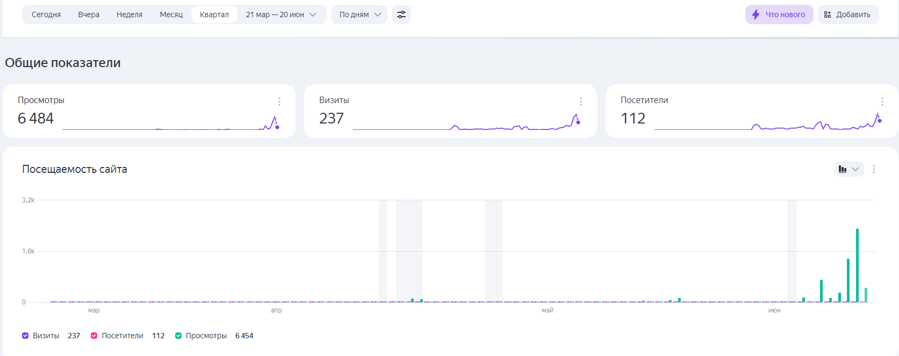
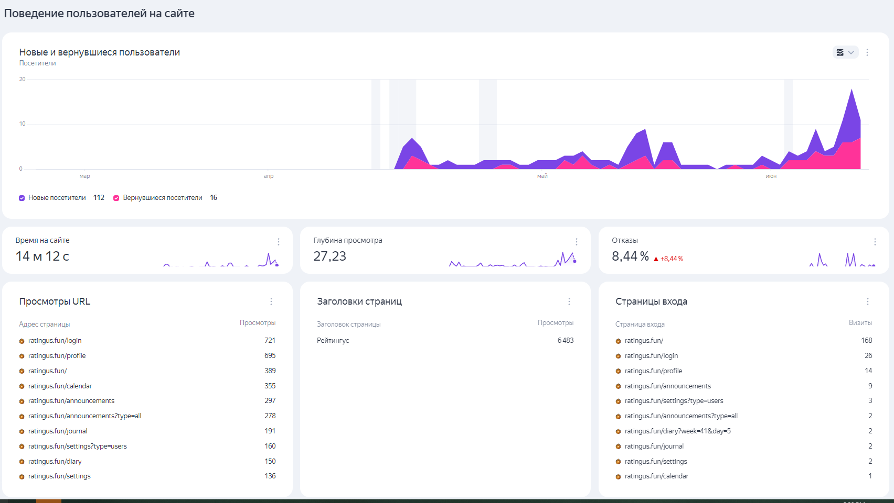
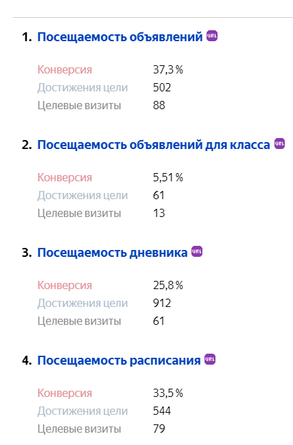
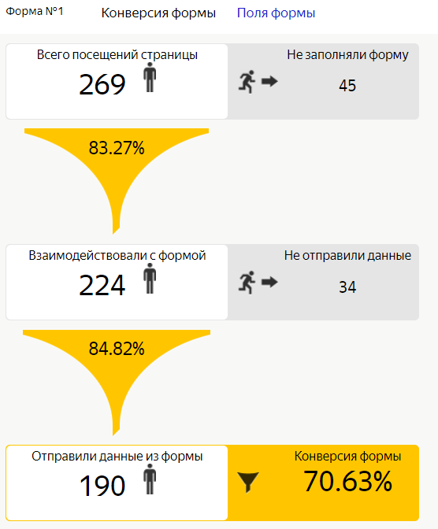
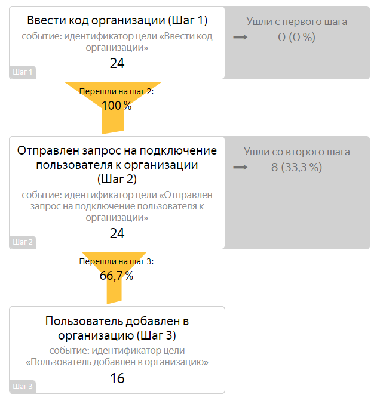
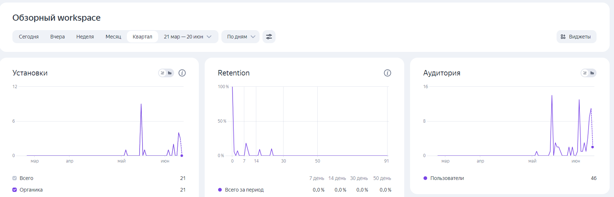
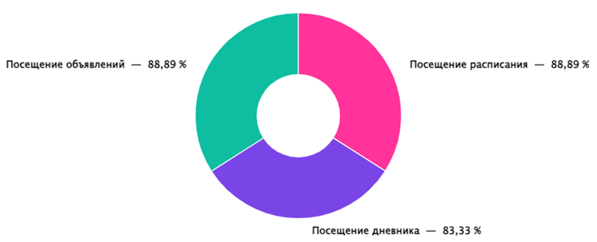
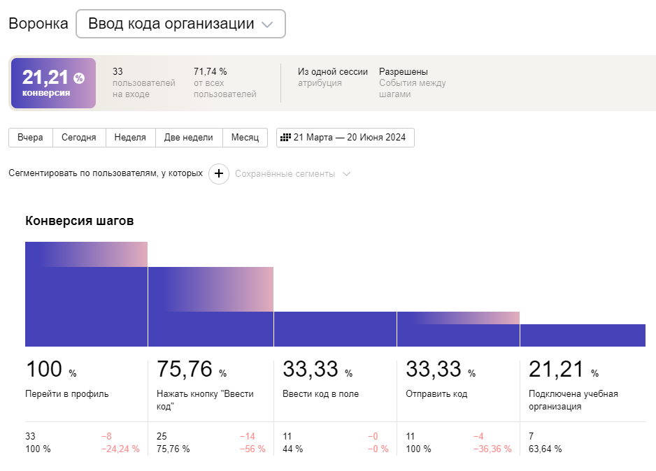
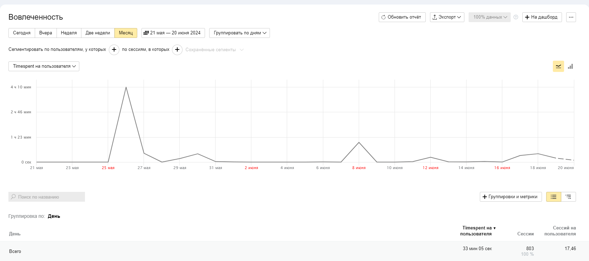

В общем случае сбор статистики настроен таким образом, чтобы:
-	понять важность реализованных разделов и оценить частоту их использования;
-	оценить удобство использования платформы;
-	оценить конверсию платформы (а именно – создание и одобрение заявок на создание учебных организаций и работу с кодом приглашения).

## [Аналитика веб приложения](https://metrika.yandex.ru/dashboard?id=97155467&period=quarter&group=day&isMinSamplingEnabled=false&accuracy=1&isSamplingEnabled=true&dashboardId=97155467%2FDefault&isWidgetsSelectorVisible=false)

### Общие показатели

### Поведение пользователей

### Посещаемость главных разделов

### Конверсия регистрации

### Воронка конверсии ввода кода приглашения

## [Аналитика мобильного приложения*](https://appmetrica.yandex.ru/overview?appId=4585621&period=quarter&group=day&currency=rub&accuracy=medium)
`* Из-за специфики AppMetrica, без доступа к Яндекс аккаунту разработчиков невозможно просмотреть аналитику мобильного приложения.`

### Обзорный workspace

### Посещаемость главных разделов

### Воронка "Ввод кода организации"

### Вовлечённость пользователей

